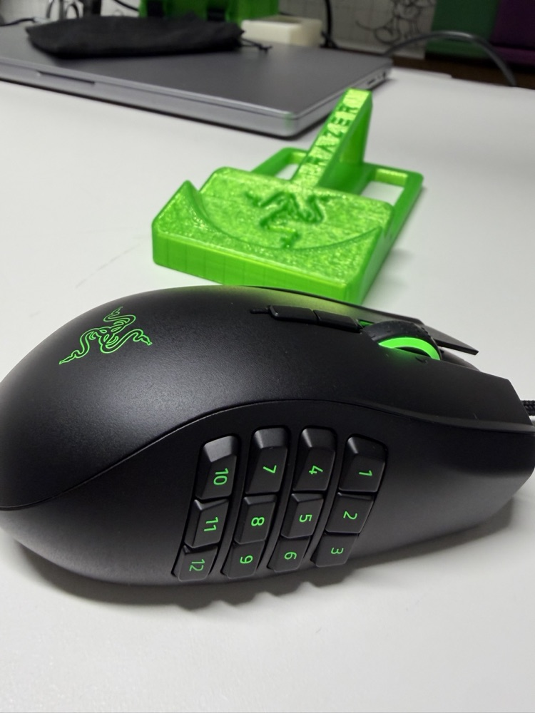
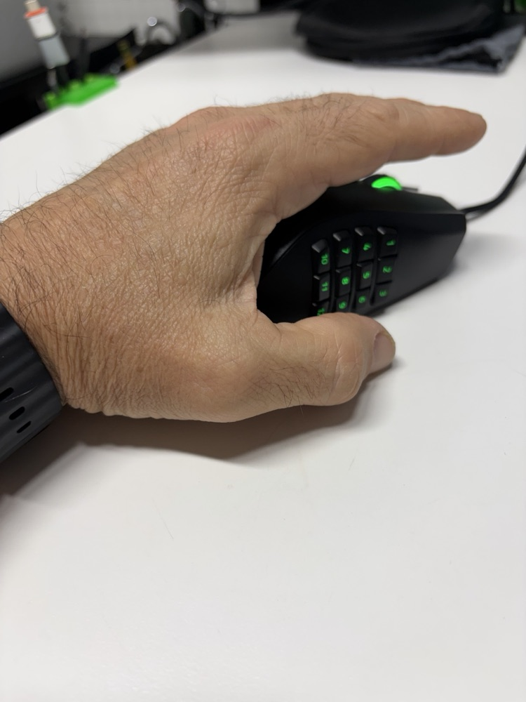
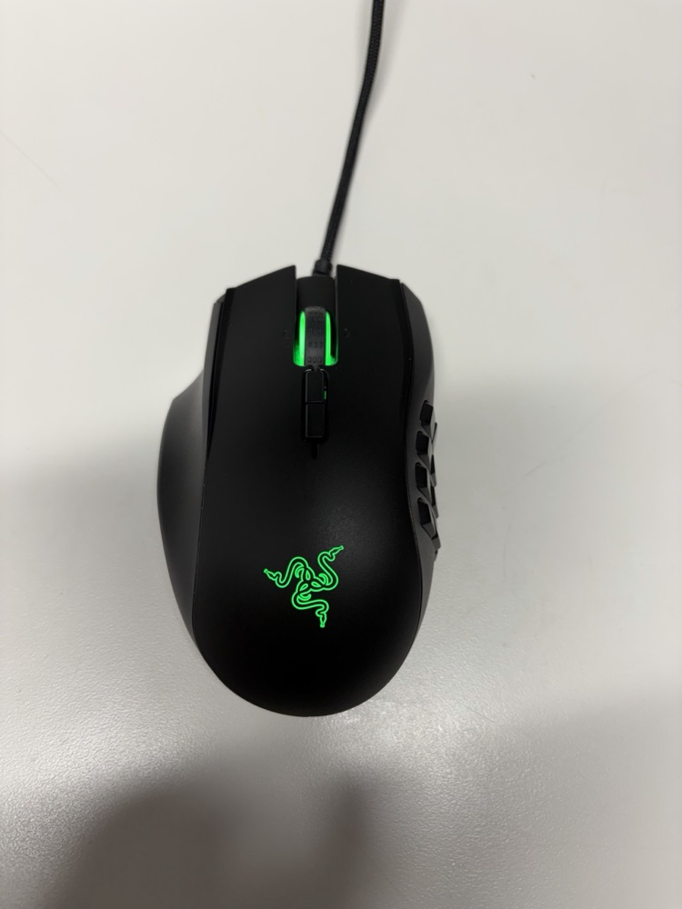

# Naga Configurator

A native macOS app that remaps the buttons on the **Razer Naga Left-Handed Edition** — the 12-button
side grid, the top buttons, scroll click, and wheel tilt. No Razer Synapse, no Karabiner, no driver
or kernel extension.

**[⬇ Download the latest release (DMG)](https://github.com/jip75/naga-configurator-native/releases/latest/download/NagaConfigurator.dmg)**
· [All releases](https://github.com/jip75/naga-configurator-native/releases)
· [Project page](https://mkrlab.io/naga-lhm)

Signed with a Developer ID and notarized by Apple. Apple Silicon, macOS 13 Ventura or later.

<p>
  
  
  
</p>

## Why this exists

On a Mac, this mouse's side grid just types `1` `2` `3` … `0` `-` `=` out of the box, and Razer's
Synapse software doesn't cover it on Apple Silicon. This app reads the mouse's raw button signals
and turns each one into whatever you actually want — a shortcut, a click, an app, a macro.

## What it does

- **Remaps 17 inputs** — side buttons 1–12, the two top buttons, scroll click, and wheel tilt
  left/right. Left click, right click, and the physical DPI button are left alone.
- **Five kinds of action per button:**
  - a keystroke with any modifiers (recorded by pressing it, e.g. `⌘⇧4`)
  - a mouse click (left, right, middle, back, forward)
  - launching an app
  - a multi-step macro, with delays between steps
  - switching the active layer
- **Three layers — Standard, HyperShift, HyperShift B.** Every button can do three different things
  depending on which layer is active, so 17 inputs become up to 51 actions.
- **Swallows the original keypress,** so a remapped side button doesn't also type its number.
  (Scroll click and wheel tilt still do their built-in action as well — the mouse handles those
  itself, and software can't intercept them.)
- **Saves locally** to `~/Library/Application Support/NagaConfigurator/mapping.json`, so your setup
  survives app updates and reinstalls.
- **No network access.** The app doesn't make any network requests.

Not wired up yet (the tabs are there, but they say so honestly instead of showing fake controls):
DPI and polling rate, scroll-wheel tuning, and Chroma lighting — the mouse keeps whatever RGB profile
is already on it.

## Install

1. [Download `NagaConfigurator.dmg`](https://github.com/jip75/naga-configurator-native/releases/latest/download/NagaConfigurator.dmg).
2. Open it and drag **Naga Configurator** into **Applications**.
3. Launch it, then grant the two permissions below when macOS asks.

Only run one copy at a time. If a second copy is launched, it quits itself, because two copies would
fight over the same input stream.

## Permissions, and why each one is needed

macOS will ask for two permissions. Both live in **System Settings → Privacy & Security**.

| Permission | Why the app needs it |
|---|---|
| **Input Monitoring** | To read the raw button presses coming from the mouse (via IOHIDManager). Without it, the app can't tell which button you pressed. |
| **Accessibility** | To send the keystroke or click you mapped (via CGEvent), and to swallow the mouse's original `1`–`=` keypress so it doesn't also type. |

If a button stops responding after an update, open those two panes, switch **Naga Configurator**
off and back on, then relaunch the app.

**Why it isn't sandboxed or on the Mac App Store:** the App Sandbox blocks both raw HID device reads
and system-wide input injection, and there's no entitlement that restores them — those are the app's
whole job. It ships as a Developer ID-signed, notarized DMG instead.

## Using it

1. On the **Customize** tab, click a numbered button or a top button on the mouse diagram.
2. In the side panel, assign a keystroke, mouse click, app launch, or macro.
3. Use the **Standard / HyperShift / HyperShift B** pills to set a second and third action for the
   same button.
4. Use the **Top View / Side View** thumbnails to reach every button.
5. Click **Save** — nothing is written to disk until you do.

## Build from source

Requires Xcode 15+ (Swift 5.9) on an Apple Silicon Mac.

```bash
swift build -c release
swift run NagaConfigurator
```

`scripts/release.sh` assembles `build/NagaConfigurator.app`, signs it, and packages the DMG. To sign
and notarize with your own Apple Developer account, set `SIGN_IDENTITY` and a `notarytool` keychain
profile (`NOTARY_PROFILE`) first — the script's header explains how.

### Repository layout

| Path | What's there |
|---|---|
| `Sources/NagaConfigurator/` | The SwiftUI app — HID capture and injection in `HID/`, UI in `Views/` |
| `Sources/HIDSenderProbe/` | A small developer tool used to discover which HID report each button sends |
| `scripts/` | `release.sh` (build, sign, notarize, DMG) and `install.sh` (command-line install from a downloaded DMG) |
| `electron/`, `src/` | The original Electron + Karabiner prototype, kept for reference. It's superseded by the native app. |

## Reporting bugs

Open an [issue](https://github.com/jip75/naga-configurator-native/issues) with your macOS version, the
app version (shown on the **About** tab), and what the button did compared with what you expected.

## License

[MIT](LICENSE).

Not affiliated with, endorsed by, or sponsored by Razer Inc. "Razer" and "Naga" are trademarks of
Razer Inc.
